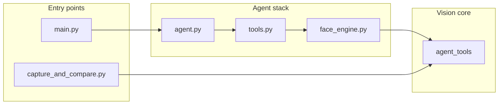

# CS-450 Face Candy Agent

Face-recognition candy dispenser project for CS-450. The system captures a face from a webcam, builds a FaceNet embedding, matches against known identities (and optional visitor memory), and decides whether to dispense candy.

## Features

- **Webcam capture** with OpenCV; **FaceNet** embeddings via `facenet-pytorch` (CPU).
- **Named identities** under `known_faces/` with optional **candy history** in `served.json` (see `capture_and_compare.py` and `agent_tools/`).
- **Agentic pipeline** (`python main.py`): tool-style API, decision loop, reasoning logs, and **anonymous visitor embeddings** persisted under `database/` (see Architecture).

## Architecture



- **`main.py`** — CLI entry; runs `run_agent()` in a **loop** until you press **Ctrl+C** (each iteration opens capture again; quitting capture with `q` skips that round and the loop continues).
- **`agent.py`** — Orchestrates tools, applies the similarity threshold, writes timestamped **reasoning logs**, dispenses or denies candy, and stores new visitor embeddings when appropriate.
- **`tools.py`** — Stable tool surface used by the agent (capture, detect, embed, compare, dispense, store).
- **`face_engine.py`** — Implements capture, embedding extraction, cosine similarity against `known_faces` plus `database/*.pt` visitor memory.
- **`agent_tools/`** — Shared primitives: MTCNN/InceptionResnetV1 config, paths, `capture_image`, `load_known_embeddings`, enroll/recognize helpers, served-file I/O.

### Agentic AI (course scope)

This repo implements **agentic behavior** as a **custom tool-using agent**: explicit **tools**, a **closed-loop policy** (`run_agent`), **memory** (embeddings on disk), and **auditable decisions** (structured logs). That matches the “agents call tools and manage state” idea used in many courses and in robotics pipelines.

We did **not** wire in **OpenClaw**, LangChain, CrewAI, or another LLM-centric orchestration framework: the policy here is **deterministic** (embedding similarity vs a threshold), not LLM-planned. If your rubric requires a named third-party framework, the next step would be to expose `run_agent()` or individual tools to that framework as **skills/tools** while keeping this FaceNet path as the source of truth.

**Rubric check:** If your assignment text requires OpenClaw or another *named* library, confirm with your **TA or instructor** whether this **custom** tool-using agent counts as “any agent framework” before the deadline.

## Requirements

- Python **3.11** (recommended; matches pinned wheels in `requirements.txt`).
- Webcam for interactive runs.

**Do not change pinned versions** in `requirements.txt` unless the course staff allows it.

## Setup

```bash
git clone <YOUR_REPO_URL>
cd CS-450-Final-Project

python3.11 -m venv .venv
# Windows: .venv\Scripts\activate
# macOS/Linux: source .venv/bin/activate

python -m pip install --upgrade pip setuptools wheel
python -m pip install -r requirements.txt
```

Verify imports:

```bash
python -c "import torch, PIL, facenet_pytorch; print('Setup works')"
```

## Usage

### Named-identity flow (original demo)

```bash
python capture_and_compare.py
```

Opens the webcam; after a short warmup it **captures automatically** when a frontal face is visible (no keypress). Press **`q`** to cancel that capture. The program matches or enrolls a **named** identity under `known_faces/` and uses `served.json` for repeat-visit candy rules. Follow on-screen prompts.

### Agentic embedding-memory flow

```bash
python main.py
```

Same automatic capture behavior (via `agent_tools.capture_image`: warmup, then snapshot when OpenCV sees a face, with a timeout fallback). Runs **repeatedly** until **Ctrl+C**. If you press **`q`** in the capture window, that round aborts and the next iteration starts again. The agent compares the live embedding to **known faces** plus **saved visitor embeddings** in `database/`. Above-threshold similarity → *already seen* (no candy); otherwise → dispense (log) and persist a new visitor vector. Generated `database/*.pt` files are **gitignored**.

## Testing

Place a face image as `test.jpg` in the project root (file is gitignored if you use a local copy), then:

```bash
python test_facenet.py
```

Expect a printed embedding shape `torch.Size([1, 512])` and no traceback.

## Project layout

```
CS-450-Final-Project/
├── agent_tools/           # FaceNet + IO helpers
├── database/              # Visitor .pt memory (artifacts gitignored)
├── face_engine.py         # Agent-facing vision + memory logic
├── tools.py               # Tool wrappers for the agent
├── agent.py               # run_agent() + reasoning logs
├── main.py                # Entry point for the agent
├── capture_and_compare.py # Named identity + served.json demo
├── known_faces/           # Reference face images (add your own)
├── served.json            # Who already received candy (names)
├── requirements.txt
└── README.md
```

## Configuration notes

- **Camera index**: if the wrong device opens, edit `agent_tools/capture_image.py` (default `cv2.VideoCapture(0)`).
- **Agent similarity cutoff**: `AGENT_SIMILARITY_THRESHOLD` in `agent.py` (default `0.8`). Enrollment/match threshold in modular tools remains `agent_tools.config.THRESHOLD` (`0.7`).

## Contributors

| Contributor | GitHub | Role on this repository |
|-------------|--------|-------------------------|
| **Justin** | [Justinpg05](https://github.com/Justinpg05) | **Initial codebase**: modular `agent_tools/` package (capture, embeddings, recognize/enroll, served JSON helpers), `capture_and_compare.py` end-to-end demo, FaceNet test script, `requirements.txt`, sample assets, and original project documentation scaffold. |
| **Marvee** | [Marveeb10](https://github.com/Marveeb10) | **Agentic layer**: `main.py`, `agent.py`, `tools.py`, `face_engine.py`, `database/` visitor memory layout, `.gitignore` updates for capture/test artifacts and embedding files, README rewrite for architecture and course clarity, and the `agent-ai` feature branch with commit *Agent AI implemented*. |

## Future improvements

- Multiple images per identity for robust matching  
- Optional LLM/agent-framework wrapper (OpenClaw, LangChain, etc.) for natural-language control while reusing the same tools  
- Cooldown rules (e.g. once per day), richer persistent logs  
- Hardware integration (e.g. Arduino dispenser)
